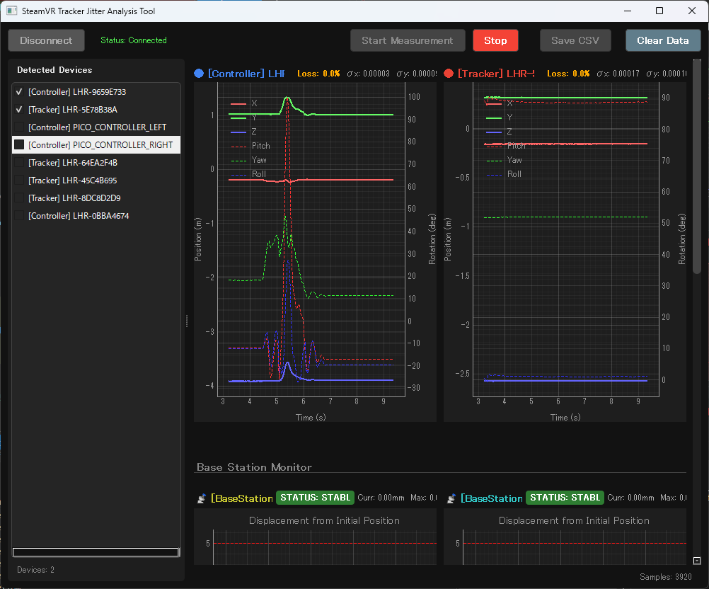

# SteamVR Tracker Jitter Analysis Tool

VRトラッカーのジッタ（位置・回転のブレ）をリアルタイムで可視化・解析するツールです。  
ベースステーション(BS)環境の最適化や、トラッキング精度の検証に利用できます。



## ✨ Features

- **リアルタイム可視化**:
    - **位置 (X/Y/Z)**: 左軸で表示 (メートル)
    - **回転 (Pitch/Yaw/Roll)**: 右軸で表示 (度)
- **統計解析**:
    - 直近500サンプルの標準偏差(σ)をリアルタイム計算・表示
    - トラッキングロス率（%）の監視
- **ベースステーション監視**:
    - **Drift Monitor**: BSの位置ズレ（振動や熱膨張によるドリフト）を検知し警告
    - 距離表示: トラッカーから各BSまでの距離を表示
- **使いやすいUI**:
    - 複数デバイス対応（トラッカー、コントローラー）
    - 不要なデバイスの非表示機能
    - 自動スケール調整・グリッド表示
- **データ保存**:
    - 全データ（位置、回転、σ値）をCSV形式で保存可能
    - MATLAB等での解析に最適

## 📦 Installation & Usage

### 実行ファイルを使用する場合 (Windows)
1. `dist/SteamVR_Jitter_Tool.exe` をダウンロード・配置します。
2. **SteamVR** を起動し、トラッカーの電源を入れます。
3. `SteamVR_Jitter_Tool.exe` を実行します。
4. 「Start Measurement」ボタンをクリックして計測を開始します。

### ソースコードから実行する場合
Python 3.10+ が必要です。

```bash
# 依存ライブラリのインストール
pip install -r requirements.txt

# 実行
python main.py
```

## 📝 Usage Details

1. **デバイス選択**:
   - 左側のリストから、測定したいデバイスにチェックを入れます。
   - デフォルトでは全てOFFになっています。
2. **グラフの見方**:
   - **実線 (RGB)**: 位置 (X, Y, Z)
   - **点線 (RGB)**: 回転 (Pitch, Yaw, Roll)
   - 右上の凡例で各線の色を確認できます。
3. **データ保存**:
   - 「Save CSV」ボタンを押すと、現在までのデータをCSVファイルに出力します。

## 📄 License

**GPL v3**

本ソフトウェアは PyQt5 を使用しているため、GPL v3 ライセンスの下で提供されます。
ソースコードの改変・再配布を行う場合は、同一ライセンス（GPL v3）を継承する必要があります。

Source Code: [https://github.com/shun20010921/SteamVR-Tracker-Jitter-Analysis-Tool](https://github.com/shun20010921/SteamVR-Tracker-Jitter-Analysis-Tool)
